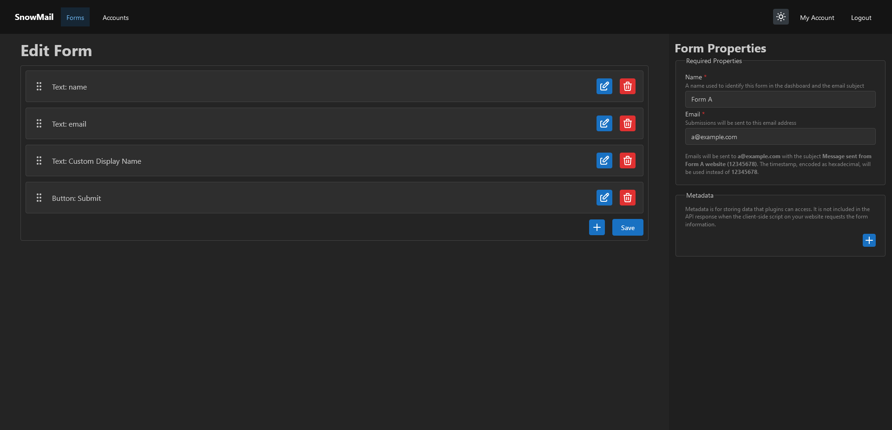

# SnowMail

SnowMail is a contact form manager for modern websites which allows for central management of contact forms across multiple websites.



## System Requirements

- Linux server (Ubuntu recommended)
- 1 CPU core
- 1GB memory
- Unblocked port 25 (not required if using a plugin to handle form submissions without SMTP)
- Docker (with compose) installed

## Installation

Download the Docker compose file from GitHub.

```sh
wget https://raw.githubusercontent.com/TrueWinter/SnowMail/main/docker-compose.yml
```

Set the following environmental variables (either in the shell, in `docker-compose.yml`, or in a `.env` file):
- `APP_SECRET`: A long (16-32 character) secret used for signing JWTs
- `EMAIL_FROM`: The email address that all contact form submissions are sent from
- `MAILNAME`: The (sub)domain part of `EMAIL_FROM`

See [.env.example](.env.example) for the full list of environmental variables.

> [!IMPORTANT]
> You should add the IP address(es) of your SnowMail instance to the SPF record of the `EMAIL_FROM` (sub)domain and configure reverse DNS. Use a service like [mail-tester](https://www.mail-tester.com) to test your configuration.

Then, start the container:

```sh
docker compose up -d
```

> [!NOTE]
> While it is possible to run SnowMail without Docker, using Docker allows you to set up a SnowMail instance with MongoDB and an SMTP server in just a few commands.

SnowMail runs on port 8025 by default. It is recommended to run SnowMail behind a reverse proxy with SSL configured.

### DKIM

DKIM is optional, but recommended as some email providers drop unsigned emails. To configure DKIM, run the following commands in `./data/dkim` to create new DKIM keys:

```sh
openssl genrsa -out rsa.private 1024
openssl rsa -in rsa.private -out rsa.public -pubout -outform PEM
```

Then, create a new TXT record at `dkim._domainkey.DOMAIN_HERE` with the content `k=rsa; p=PUBLIC-KEY-HERE`.

If you've already started SnowMail, run `docker compose up -d --force-recreate` to apply the changes.

## Usage

If no users exist in the database, SnowMail will create a default user with the username `admin` and password `snowmail`. It is recommended to change the password immediately after login.

The SnowMail dashboard allows you to easily create contact forms which can be added to websites with a few lines of code.

> [!IMPORTANT]
> When creating your form, create a button with the `type` set to `submit`. Without this, users won't be able to submit the form unless you write additional code.

### React

*Minimum React version: v18.2.0*

SnowMail requires Mantine (v7.8.1+) to be installed.

```sh
npm install --save @mantine/core @mantine/form
```

Then, import the `ContactForm` component:

```jsx
import ContactForm from 'snowmail/react/ContactForm.jsx';
<ContactForm url="https://snowmail.example.com" id="6627b0113f4c7e0d773abc2b" />
```

You can also pass props to the MantineProvider using the `providerProps` prop.

If you'd like to server render SnowMail, you can pass the form definition to the inputs prop. Use the `getForm` method exported by `api.js` to get the form definition. It is recommended to set the `data-mantine-color-scheme` attribute on the `html` element to either `light` or `dark` when using SSR to ensure styles are applied before hydration.

> [!TIP]
> Already using Mantine? Use the `MantineContactForm` component instead.

### Astro

Astro doesn't support React contexts which are required for Mantine to work. Additionally, React bundle sizes are quite large which can slow down website loading times. To address both of these issues, SnowMail offers an Astro component which uses a pre-built Preact bundle instead.

```jsx
import ContactForm from 'snowmail/astro/ContactForm.astro';
<ContactForm url="https://snowmail.example.com" id="6627b0113f4c7e0d773abc2b" />
```

To enable SSR, just add the `ssr` prop. It is recommended to set the `data-mantine-color-scheme` attribute on the `html` element to either `light` or `dark` when using SSR to ensure styles are applied before hydration.

> [!NOTE]
> While it is possible to set the `providerProps` prop, the Astro component only supports properties that can be JSON serialized.

### Other

It is possible to use SnowMail on websites that don't use React or Astro by importing the pre-built Preact bundle.

#### NPM

```html
<div id="snowmail"></div>
<script>
  import 'snowmail/dist/main/styles.css';
  import { render } from 'snowmail/dist/main/index.mjs';
  render({
    element: document.getElementById('snowmail'),
    url: 'https://snowmail.example.com',
    id: '6627b0113f4c7e0d773abc2b',
    providerProps: {}
  });
</script>
```

#### CDN

If you do not use a build process that supports importing from NPM, you can use SnowMail from a CDN instead.

```html
<div id="snowmail"></div>
<link rel="stylesheet" href="https://cdn.jsdelivr.net/npm/snowmail@latest/dist/main/styles.min.css" />
<script type="module">
  import { render } from 'https://cdn.jsdelivr.net/npm/snowmail@latest/dist/main/index.mjs';
  render({
    element: document.getElementById('snowmail'),
    url: 'https://snowmail.example.com',
    id: '6627b0113f4c7e0d773abc2b',
    providerProps: {}
  });
</script>
```

It is recommended to replace `latest` with a specific version number in production.

## Plugins

You can create plugins to extend SnowMail in the following ways:
- Add customized inputs (e.g. a captcha)
- Validate forms with more advanced validation criteria than SnowMail supports
- Send contact form submissions through a transactional email service provider (e.g. SendGrid) instead of SMTP
- Send contact form submissions through a webhook
- Run code whenever a form is saved (useful for triggering a website build)

Place plugin JARs in `data/plugins` and restart SnowMail.

For information on creating your own plugins, see [PLUGINS.md](PLUGINS.md).

### Official Plugins

A few official plugins are published alongside SnowMail.

> [!IMPORTANT]
> Keep these plugin versions in sync with SnowMail to avoid issues.

#### SnowCaptcha

This plugin adds a captcha widget and validation code for [SnowCaptcha](https://github.com/TrueWinter/SnowCaptcha/).

You will need to set the following metadata properties:
- `snowcaptcha-src`: URL of the SnowCaptcha JavaScript file (e.g. https://snowcaptcha.example.com/build/captcha/captcha.js)
- `snowcaptcha-host`: URL of your SnowCaptcha instance (e.g. https://snowcaptcha.example.com)
- `snowcaptcha-secret`: Website secret
- `snowcaptcha-sitekey`: Website sitekey

#### Webhook

This plugin sends a POST request to the URL of your choice. After installing the plugin, a config file will be created in `data/plugins/Webhook`. Modify the config file as needed and restart SnowMail.

The requests will have a JSON body:
- `submit` event:
```json
{
  "type": "submit",
  "values": {
    // "input-name" will be the name of the input
    "input-name": {
      "input": {
        // Input object
      },
      // The value as a string
      "value": "Lorem ipsum"
    }
  }
}
```
- `save` event:
```json
{
  "type": "save",
  "form": {
    // Form object
  }
}
```

## License

SnowMail is MIT licensed software.
